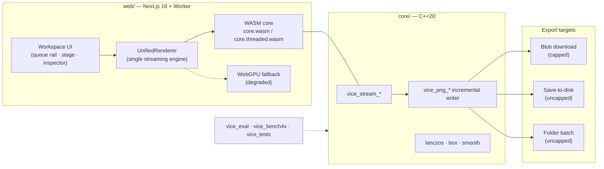
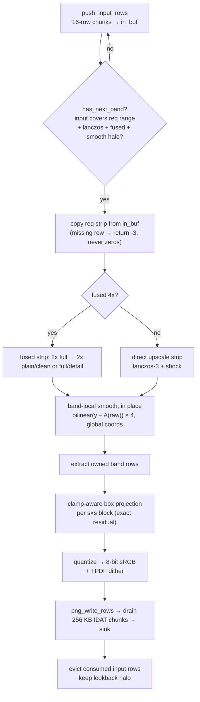
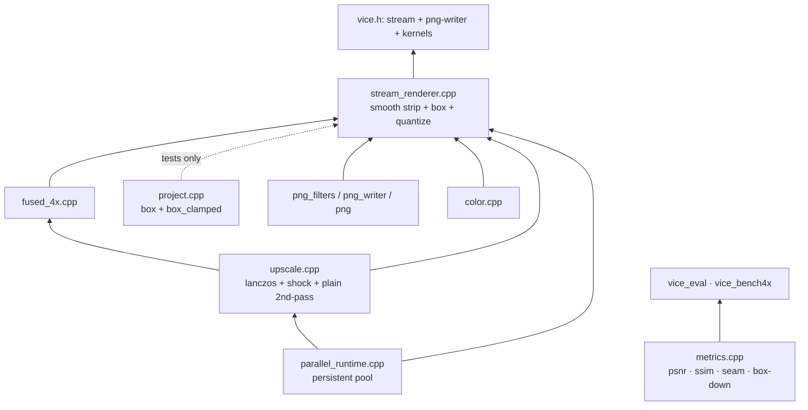
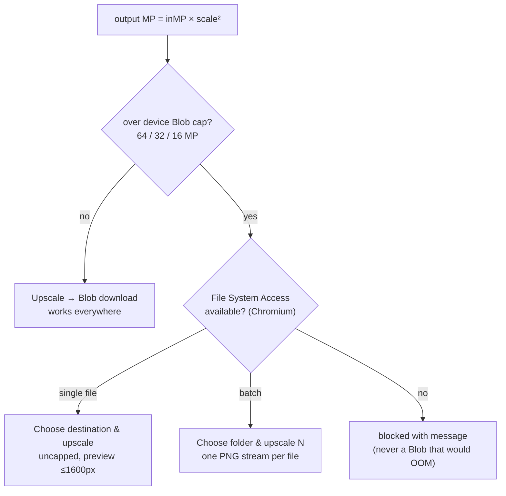
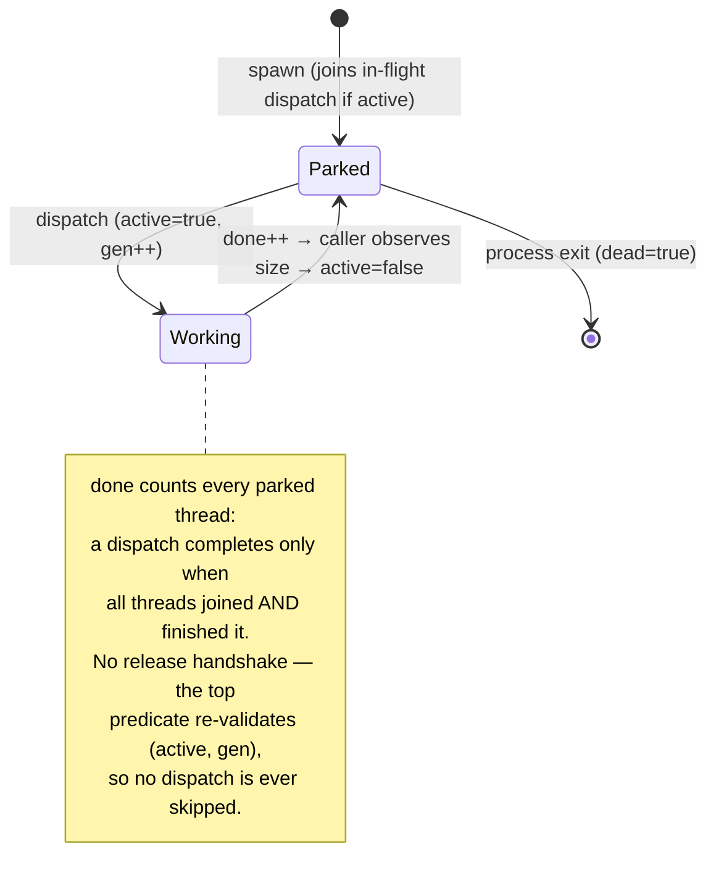
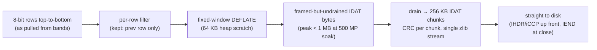

# Vice Architecture

One engine: the streaming strip pipeline (`vice_stream_*`). "Full image" is a
stream render with one band as tall as the image. See root `README.md` for
numbers.

## 1. System overview



## 2. One band render (the whole engine)



## 3. Core module map



## 4. Worker job flow (web)

```mermaid
sequenceDiagram
    participant UI as Inspector/Queue
    participant JC as JobController
    participant W as vice.worker
    participant UR as UnifiedRenderer
    participant FS as FileSystem/Blob sink
    UI->>JC: run / runToFile / runBatchToFolder
    JC->>W: file + scale + chained4x + sink
    W->>W: decode → linear float + ICC + alpha prescan
    W->>UR: render(input, {scale, chained4x}, target)
    loop 64-row bands
        UR->>UR: upscale → smooth → box → quantize
        UR->>FS: write PNG chunk (1-in-flight ack)
        UR->>UI: progress(rows/total)
    end
    UR->>UI: complete{residual, backend, threads, fileBytes}
    Note over UI,FS: Blob path capped per device tier;<br/>disk/folder paths uncapped
```

## 5. Export routing + caps



## 6. Thread-pool states (`parallel_runtime.cpp`)

One persistent pool; threads are spawned once and park between dispatches.
The caller always participates as one more worker.



Rules: `VICE_MAX_WORKERS=N` caps the count, ranges under 32 rows stay
serial, nested/re-entrant calls from inside a worker run inline.

## 7. Incremental PNG framing (`vice_png_*`)



`close()` fails unless exactly `h` rows were fed; `drain()` returns
`written == 0` when nothing is pending. Color type is fixed at `open`
(RGB vs RGBA decided from input alpha, not by scanning output).

## 8. Eval / bench policy matrix

| Tool | Policies (all stream API) | Reference columns |
|------|---------------------------|-------------------|
| `vice_eval` | `direct` (default, ships), `clean` (fused mode 1 = shipped 2××2×), `chained` (fused mode 2, engine-only) | raw = Lanczos-only baseline; proj scored in linear light |
| `vice_bench4x` | A tall-direct, B tall-clean, C band-direct, D band-clean, E band-detail | `psnr/B` (tall-clean ref), `psnr/A` (tall-direct ref); D tracks B 41–44 dB |

Tall band (`band_h` = image height) reproduces the retired full-image path:
tall-vs-banded measures 95–999 dB, i.e. band size is nearly irrelevant.
All policies gate on residual < 1e-5; E (detail) never beats D at ~1.5–1.7×
the cost, so only Clean + Direct ship in the UI.
