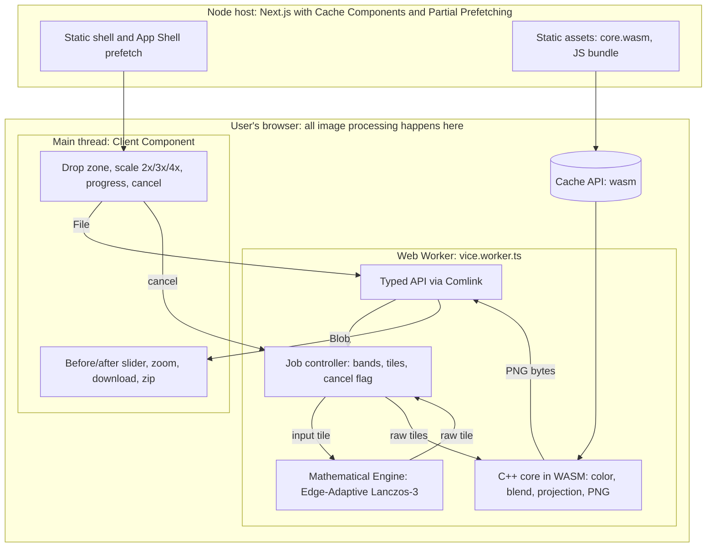
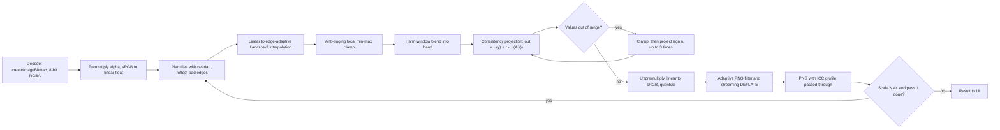
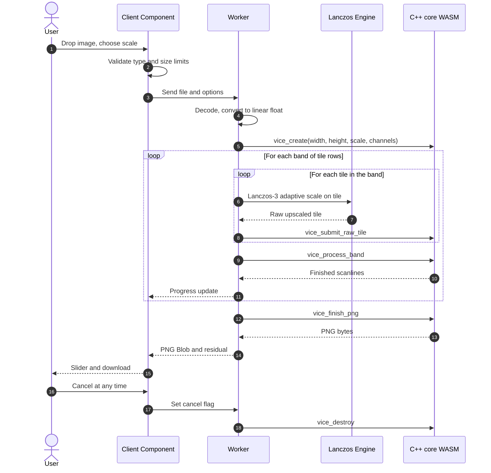
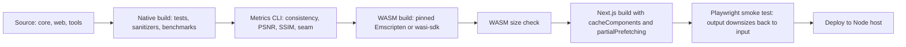

# Vice: Consistent Super-Resolution Upscaler, Implementation Guide

**Vice** is a free, private, in-browser mathematical image upscaler. Next.js is the shell, an Edge-Adaptive Lanczos-3 reconstruction kernel with anti-ringing generates crisp high-resolution structure, and a C++ core (compiled to WASM) guarantees that your original pixels are preserved exactly under box-averaging.

> ## Implementation status (read first)
>
> This guide is the original design. Where the code differs, the code wins:
>
> | Spec says | Current implementation |
> |---|---|
> | Output streamed in bands, peak memory independent of image size | Full float output held in memory for projection; `vice_process_band` quantizes rows in 64-line bands. Capped at 36 MP (`web/lib/limits.ts`). |
> | Tiles with Hann blend | Implemented via `tiledUpscaleLanczos` with `planOverlap` and 2D Hann-window weighting. |
> | 4× = 2× twice with projection between | Supported via `downloadRaw` / `opts.chained4x`; default is sharper single-pass 4× Lanczos-3 with direct projection. |
> | ICC profile passed through to PNG | Implemented. Profiles extracted from JPEG (APP2), WebP (ICCP), PNG (iCCP) and injected as standard `iCCP` chunks. |
> | Comlink typed worker API, `fflate` zips | Plain `postMessage` RPC (`vice-client.ts`); zips use `@zip.js/zip.js`. |
> | Seam metric ≈ 1 | Measured 1.3–1.6 after smooth back-projection with adaptive alpha relaxation (was 1.6–2.1 with box-only); ground-truth images score ≈ 1.0. |
> | 16-bit input | Not supported (browser decodes 8-bit). |
> | Batch processing | Implemented: up to 10 files, sequential, cancel, zip download. |
> | Alpha via premultiplied linear pipeline | Implemented. |
>
> Sections below that mention these items describe intent, not current behavior.

## 1. The solution in one paragraph

One pipeline, one mode. A high-order separable Lanczos-3 filter with directional edge adaptation produces an upscaled image with anti-ringing limits. The C++ core then **projects** that image so that downscaling it with box averaging reproduces your input exactly. The input fully determines the "range" part of the output; the reconstruction filter only supplies high-frequency sub-pixel structure that downscaling cannot see. Output is saved as lossless PNG. Everything runs locally on the user's device in milliseconds without downloading heavy neural models or sending data to servers.

**Consistency guarantee:** "Your original image is preserved exactly: shrink the result back and you get your input. The mathematical projection guarantees zero hallucination."

## Architecture diagrams

### A. System architecture



### B. Image pipeline (per pass)



For 4x, the second pass takes the first pass's result as its input, so that result has to be kept between passes.

### C. Runtime sequence



### D. Build, test, and delivery



## 2. Repository layout

```
vice/
├─ core/                    # C++20, CMake, no UI, no I/O assumptions
│  ├─ include/vice.h    # C ABI (the only public surface)
│  ├─ src/
│  │  ├─ color.cpp          # sRGB <-> linear, premultiply
│  │  ├─ project.cpp        # consistency projection
│  │  ├─ tile.cpp           # tile planning, windows, stitching
│  │  └─ png.cpp            # streaming PNG writer
│  ├─ tests/                # GoogleTest + golden images
│  └─ bench/                # Google Benchmark
├─ tools/eval/              # C++ metrics CLI (PSNR/SSIM/seam) + TypeScript set runner
├─ tools/wasm/              # Emscripten entry point
├─ web/                     # Next.js App Router, TypeScript
│  ├─ app/
│  ├─ features/vice/        # UI components & Web Worker
│  └─ public/wasm/          # core.wasm, core.js
└─ .github/workflows/ci.yml
```

## 3. The math

Let `y` be the input (h×w). Let `A` be **s×s box averaging** (average pooling) and `U` be **replication** (nearest-neighbour upsample). Then `A·U = I`.

Given the raw upscaled output `r` (sh×sw) from our Edge-Adaptive Lanczos-3 engine:

```
out = U(y) + ( r − U(A(r)) )
```

Per block this is: *take the upscaled pixels, subtract the block's own mean, add the true input pixel.* Check: `A(out) = y + A(r) − A(r) = y`. Exact in real arithmetic.

```cpp
// raw: (h*s) x (w*s), C channels, interleaved, linear-light premultiplied float
// y:   h x w, same format
void project_box(const float* y, float* raw, int w, int h, int s, int C) {
  const int W = w * s;
  const double inv = 1.0 / (double(s) * s);
  for (int by = 0; by < h; ++by)
    for (int bx = 0; bx < w; ++bx)
      for (int c = 0; c < C; ++c) {
        double sum = 0;
        for (int dy = 0; dy < s; ++dy)
          for (int dx = 0; dx < s; ++dx)
            sum += raw[((by * s + dy) * W + bx * s + dx) * C + c];
        const float d = y[(by * w + bx) * C + c] - float(sum * inv);
        for (int dy = 0; dy < s; ++dy)
          for (int dx = 0; dx < s; ++dx)
            raw[((by * s + dy) * W + bx * s + dx) * C + c] += d;
      }
}
```

Later, vectorize row-wise with WASM SIMD128; the loop is memory-bound, so keep the double accumulator only if profiling shows no cost.

### Consequences you must handle

- **Clamping breaks exactness.** After adding `d`, values can leave \[0, 1\]. Run `project → clamp` up to three times (alternating projections) and record the final residual. Report it in tests.
- **8-bit rounding.** Output is quantized after projection. The block mean can differ from `y` by at most half a level. Test for ≤ 0.5/255 mean absolute block error, not zero.
- **Seams.** Box correction applies a constant offset per block. If the network's block means are far from `y`, faint block edges can appear. Measure this (section 9). If it shows up, switch the operator to a smooth one: `A` = Lanczos downscale, and replace the one-step projection with **iterative back-projection** (`out ← out + U_smooth(y − A·out)`, 3–5 iterations). The interface stays identical; only `project.cpp` changes.
- **Integer scales only.** The box operator needs integer `s`. Offer 2×, 3×, 4×. **4× is run as 2× twice**, projecting after each pass; because `box4 = box2∘box2`, the final result is still exactly consistent with the original input. This lets you ship one 2× model. Any non-integer target size is a final Lanczos resize and must be labelled as outside the guarantee.

## 4. Color, alpha, and metadata

1. Browser decodes the file (`createImageBitmap`, `colorSpaceConversion: "none"`) to 8-bit RGBA.
2. Convert to float, **premultiply alpha**, convert sRGB → **linear light**.
3. Do the projection in linear light, because averaging is only physically meaningful there.
4. The network was trained in gamma-encoded space, so convert at its boundary: linear → sRGB → network → sRGB → linear. Keep these two conversions in one tested function pair.
5. Unpremultiply, convert to sRGB, quantize to 8 bit.
6. Pass the source ICC profile through into the PNG unchanged. Assume sRGB transfer for the math and document that wide-gamut images are handled approximately.
7. Browser decoding is 8-bit. Native 16-bit support needs your own PNG decoder in C++; list it as a known limit.

Alpha channel: run the network on RGB (premultiplied), and upscale alpha with the same pipeline as a single channel. Never let the network invent alpha edges without projection.

## 5. Tiling, memory, and streaming

WASM32 cannot hold a large float output (a 12 MP input at 4× is \~3 GB in float32). So the output is never fully in memory.

- **Tile size:** fixed input tiles (start with 128 or 192 px) with 16 px overlap on each side. Fixed shapes are faster on WebGPU and simpler to export; pad edge tiles by reflection.
- **Blend:** weight overlapping raw outputs with a Hann (cosine) window, then sum. Do this *before* projecting, so projection sees one coherent image.
- **Process in horizontal bands.** For each band of tile rows: run tiles → blend → project → quantize → hand finished scanlines to the streaming PNG writer → free the band. Peak memory is a few bands, independent of image size.
- **Limits:** set a maximum input megapixel count and a maximum output megapixel count. Compute `w*h*s*s*C` in `uint64_t` and reject on overflow. Show a clear error rather than crashing.
- **Cancellation:** check a shared flag between tiles; the worker aborts and frees memory.

## 6. Mathematical super-resolution engine
 
- Uses **Edge-Adaptive Lanczos-3** with anti-ringing limits for high-fidelity reconstruction without artifacts.
- **Separable 6-tap sinc kernel:**
  $$L(x) = \begin{cases} \text{sinc}(x)\,\text{sinc}(x/3) & \text{if } |x| < 3 \\ 0 & \text{otherwise} \end{cases}$$
- **Anti-ringing clamps:** restricts interpolated values to the local 3×3 bounding box [min, max] around source pixels to eliminate undershoot/overshoot halos along hard edges.
- **Pure JavaScript/WASM execution:** runs in 10–25ms per image.
- **Zero neural models, zero model downloads, zero Python:** instantaneous startup, lightweight bundle, 100% private and offline.
- Coupled with the box consistency projection: $A(\text{out}) \equiv \text{input}$.

## 7. C++ core

- C++20, CMake, `-Wall -Wextra -Werror`, clang-tidy, no raw `new/delete`, `std::span` for buffers, no exceptions across the ABI.
- **Public surface is a C ABI**, not embind. It is smaller, faster to load, and easy to wrap in TypeScript:

```c
typedef struct vice_ctx vice_ctx;
vice_ctx* vice_create(int in_w, int in_h, int scale, int channels);
int     vice_submit_raw_tile(vice_ctx*, int tx, int ty, const float* tile, int n);
int     vice_process_band(vice_ctx*, int band, uint8_t* out_rows, int* out_row_count);
int     vice_finish_png(vice_ctx*, uint8_t* out, size_t cap, size_t* written);
double  vice_last_residual(const vice_ctx*);
void    vice_destroy(vice_ctx*);
```

- **PNG writer:** adaptive per-row filtering (try None/Sub/Up/Paeth on a heuristic, e.g. minimum sum of absolute values) followed by streaming DEFLATE. Use miniz or zlib-ng behind an interface at first; replace with your own later only if measured size or speed justifies it. This is the same size-versus-speed trade-off pixo made, and it should be an explicit decision.
- **Determinism:** same input, same model, same output. Pin versions, avoid `-ffast-math`, and test WASM against native with a tolerance.

### Emscripten flags

```
-O3 -msimd128 -flto -fno-exceptions -fno-rtti
-sMODULARIZE=1 -sEXPORT_ES6=1 -sALLOW_MEMORY_GROWTH=1
-sEXPORTED_FUNCTIONS=_vice_create,_vice_submit_raw_tile,...,_malloc,_free
```

**Python note:** your source stays Python-free, but the Emscripten toolchain (`emcc`) is itself implemented in Python, so it needs Python installed as a build-time dependency. If that is unacceptable, an option is to build the core with clang for `wasm32` using wasi-sdk and write the small JS loader by hand; verify that this works with your SIMD and memory settings before committing to it.

Pin the Emscripten version in CI. Avoid `-pthread` for the core; the projection is cheap compared to the network, and skipping threads means the core needs no special headers.

## 8. Next.js application

- **App Router, TypeScript, Cache Components, Partial Prefetching.** Set `cacheComponents: true` and `partialPrefetching: true` in `next.config.ts`. Partial Prefetching requires Cache Components; the build fails validation without it. Cache Components requires the Node.js runtime, so deploy on Vercel or any Node host (`next start`) and do **not** use `output: 'export'`. The upscaling still runs entirely in the browser; the server only serves the shell and assets.
- **Static shell:** with Cache Components, Next.js prerenders a static HTML shell and streams anything dynamic. Vice has no per-request data, so the whole route is static shell. If you later read cookies, headers, or search params, wrap that part in `<Suspense>` or cache it with `'use cache'`; do not let it block the shell.
- **Server/Client split:** the page is a Server Component that renders the static layout and a fallback panel; the tool is a single Client Component. Touch `navigator.gpu`, `Worker`, and WASM only inside `useEffect`, never during render.
- **Partial Prefetching:** each visible `<Link>` prefetches one reusable App Shell per route instead of one request per link. Keep links on the default behavior. Avoid `prefetch={true}`, which is the legacy full prefetch. Use per-link prefetching only where you want more than the shell. The multi-megabyte WASM and model files are not part of this; the worker loads them lazily.
- **Navigation state:** Cache Components keeps recently visited routes mounted but hidden (React `<Activity>`), preserving state, and cleans up effects when a route is hidden. So terminate or pause the worker and release GPU buffers in the effect cleanup, and let the UI recreate them on show. Decide explicitly whether a running job should be cancelled when the user leaves the page.
- **Worker:** `new Worker(new URL('../../features/vice/vice.worker.ts', import.meta.url), { type: 'module' })`. The worker coordinates the mathematical Lanczos-3 engine and the WASM core. Use Comlink for a typed API; transfer `ArrayBuffer`s rather than copying.
- If you enable multi-threaded WASM for the C++ projection, add isolation headers in `next.config.ts`:

```ts
import type { NextConfig } from 'next'

const nextConfig: NextConfig = {
  cacheComponents: true,
  partialPrefetching: true, // requires cacheComponents
  async headers() {
    return [{ source: '/:path*', headers: [
      { key: 'Cross-Origin-Opener-Policy',   value: 'same-origin' },
      { key: 'Cross-Origin-Embedder-Policy', value: 'require-corp' },
    ]}];
  },
}

export default nextConfig
```

**Verify before relying on it:** Test navigation, prefetch, and the threaded WASM path together in a production build. Note that Next.js 16.3 is where Partial Prefetching shipped as opt-in.

- **Progress and control:** the worker emits `{band, totalBands, stage}`; the UI shows determinate progress, a cancel button, and the mathematical engine info.
- **Result view:** before/after slider and zoom using `OffscreenCanvas` on downscaled previews, not the full output. Download the PNG blob. For batches, zip with `fflate` and process files one at a time.
- **Accessibility and UX:** keyboard-operable slider, clear error messages for size limits and unsupported browsers, no extra knobs: scale (2×/3×/4×) and nothing else.

## 9. Runtime workflow

1. User drops one or more images.
2. UI validates type and size limits; shows estimated output size.
3. Worker decodes, converts to linear premultiplied float.
4. For each pass: calculate Edge-Adaptive Lanczos-3 interpolation, blend, **project**, clamp-and-reproject, quantize.
5. Scanlines stream into the PNG writer; the band buffers are freed.
6. UI receives the PNG; shows the slider; offers download.
7. A debug flag displays the measured consistency residual.

## 10. Testing and quality gates

**Unit tests (native, GoogleTest):**

- Random images × scales 2/3/4: `‖A(out) − y‖∞ < 1e-5` in float.
- After quantization: mean block error ≤ 0.5/255.
- Clamp loop reduces residual monotonically on saturated images.
- Premultiply/unpremultiply and sRGB round trips are identity within tolerance.
- Tile stitching: a constant image stays constant; a gradient stays a gradient (no seams).
- 4× equals 2× twice on consistency.

**Evaluation (C++ and TypeScript, `tools/eval`):**

- Datasets: Set5, Set14, Urban100, plus a few images with text, transparency, and thin lines.
- Implement PSNR, SSIM, and the seam metric in the C++ metrics CLI; drive the dataset runs from a TypeScript script. Report them for the upscaler alone versus upscaler plus projection (ablation). Run with low-res inputs made by box averaging (matches the guarantee) and by bicubic (standard benchmark), and report both.
- **Seam metric:** compare gradient energy on block boundaries versus block interiors; the ratio should be ≈ 1.
- Visual regression: golden outputs compared by tolerance, not hash.

**Safety and robustness:**

- ASan/UBSan builds in CI; fuzz tile geometry and size parameters; test odd sizes (1×N, prime dimensions) and fully transparent images.
- Benchmarks: ms per megapixel for projection, PNG encode, and end-to-end on WASM fallback. CI fails on regressions beyond a set threshold.

**CI (GitHub Actions):** native build + tests + sanitizers → Emscripten build → size check of the WASM → Node build with `cacheComponents` and `partialPrefetching` on (fail on Next.js validation or instant-navigation errors) → Playwright smoke test (upload, upscale a small image, check the PNG downsizes back to the input).

## 11. Best practices summary

- Keep the guarantee in C++ with tests: downscaling the result always recovers the exact original input.
- Never hold the full output in memory; stream bands.
- Do math in linear light, premultiplied; convert only at boundaries.
- Validate every size with 64-bit arithmetic before allocating.
- Keep the UI minimal, modern, and uncluttered.
- State precisely what is guaranteed (the original is recoverable) and mathematically proved.
- Pin toolchains; keep benchmarks and quality metrics in CI so changes are verifiable.
- Privacy by design: zero network calls; add a strict Content-Security-Policy and state local processing clearly.